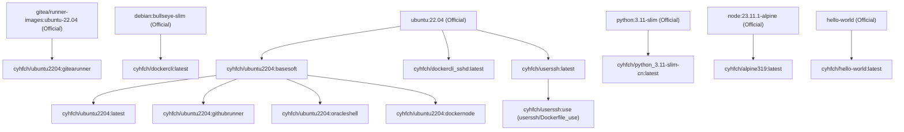

# DockerFile

[中文](#chinese) | [English](#english)

---

<a name="chinese"></a>
## 中文说明

本项目用于管理、构建和发布一系列自定义 Docker 镜像至 Docker Hub (`cyhfch/`) 和 GHCR (`ghcr.io/horacecuiorg/`)。镜像全线支持多架构（`linux/amd64` 和 `linux/arm64`）构建。

### 1. 镜像列表及基础信息

| 目录/服务路径 | 目标镜像 Tag | 基础镜像 (Base Image) | 核心说明与预装软件 |
| :--- | :--- | :--- | :--- |
| [ubuntu2204_basesoft](file:///home/ubuntu/githuborg/public/DockerFile/ubuntu2204_basesoft) | `basesoft` | `ubuntu:22.04` | **核心底座镜像**：预装 Git, Python3, Node.js LTS, docker-cli, Vault CLI, cloudflared, tmux, netcat-openbsd, socat 等，作为其它 Ubuntu 镜像的基础。 |
| [ubuntu2204](file:///home/ubuntu/githuborg/public/DockerFile/ubuntu2204) | `latest` | `cyhfch/ubuntu2204:basesoft` | 继承 basesoft，创建并配置了默认 of 默认的无密码免密 `runner` 用户 (UID 1001)。 |
| [ubuntu2204_githubrunner](file:///home/ubuntu/githuborg/public/DockerFile/ubuntu2204_githubrunner) | `githubrunner` | `cyhfch/ubuntu2204:basesoft` | 继承 basesoft，专为自建 GitHub Actions Runner 配置的特需用户组环境 (GID 118, 4, 100, 999)。 |
| [ubuntu2204_gitearunner](file:///home/ubuntu/githuborg/public/DockerFile/ubuntu2204_gitearunner) | `gitearunner` | `gitea/runner-images:ubuntu-22.04` | 专为 Gitea Runner 设计，内置 Vault CLI、SOPS 解密工具与科学计算 Python 包（pandas, numpy），默认用户为 `ubuntu`。 |
| [ubuntu2204_oracleshell](file:///home/ubuntu/githuborg/public/DockerFile/ubuntu2204_oracleshell) | `oracleshell` | `cyhfch/ubuntu2204:basesoft` | 继承 basesoft，配置了前台运行的 OpenSSH 服务，默认注入 Cuiyinhu 的公钥并以其登录。 |
| [ubuntu2204_dockernode](file:///home/ubuntu/githuborg/public/DockerFile/ubuntu2204_dockernode) | `dockernode` | `cyhfch/ubuntu2204:basesoft` | 继承 basesoft，内置可动态匹配宿主机 UID/GID 的容器入口脚本。 |
| [dockercli](file:///home/ubuntu/githuborg/public/DockerFile/dockercli) | `latest` | `debian:bullseye-slim` | 轻量化 Docker 交互环境，内置 Docker-CLI 和 Compose，能动态对齐运行时宿主机 UID/GID 权限。 |
| [dockercli_sshd](file:///home/ubuntu/githuborg/public/DockerFile/dockercli_sshd) | `latest` | `ubuntu:22.04` | 继承自 Ubuntu 并集成了 Docker CLI 和 SSH 服务，允许通过 SSH 远程访问并管理宿主机 Docker。 |
| [python_3.11-slim-cn](file:///home/ubuntu/githuborg/public/DockerFile/python_3.11-slim-cn) | `latest` | `python:3.11-slim` | 针对国内使用环境预配置的 Python 运行时环境，预装常用 Web 库并修改了阿里云 APT 与 PIP 源。 |
| [userssh](file:///home/ubuntu/githuborg/public/DockerFile/userssh) | `latest` | `ubuntu:22.04` | SSH 转发隧道客户端，提供自动断线重连、心跳保持与日志滚动裁剪功能。 |
| [alpine319](file:///home/ubuntu/githuborg/public/DockerFile/alpine319) | `latest` | `node:23.11.1-alpine` | Alpine 轻量 Node.js 23 交互镜像，并包含 Cloudflared 工具。 |
| [hello-world](file:///home/ubuntu/githuborg/public/DockerFile/hello-world) | `latest` | `hello-world` | 基础测试测试镜像。 |

### 2. 构建与部署方法

#### 目录解析与 Tag 规则
构建脚本 [build_one_Dockerfile.sh](file:///home/ubuntu/githuborg/public/DockerFile/public_scripts/build_one_Dockerfile.sh) 遵循如下的文件夹命名规则：
1. **带下划线 `_`**：前缀解析为服务名，后缀解析为 tag（例如 `ubuntu2204_basesoft` 对应服务 `ubuntu2204`，Tag 为 `basesoft`）。
2. **不带下划线**：整个目录名解析为服务名，Tag 默认为 `latest`（例如 `alpine319` 对应服务 `alpine319`，Tag 为 `latest`）。

#### 手动构建命令
```bash
DOCKER_NAMESPACE=cyhfch GHCR_ORG_NAMESPACE=horacecuiorg bash public_scripts/build_one_Dockerfile.sh <directory_name>
```

#### GitHub Actions 持续集成
*   **按需自动构建**：每次有代码变更推送到远程 `main` 分支时，[build.yml](file:///home/ubuntu/githuborg/public/DockerFile/.github/workflows/build.yml) 自动运行，识别改动的目录并仅编译发生了变更的服务。
*   **手动按需构建**：也可以通过 Actions 界面的 [manual_build.yml](file:///home/ubuntu/githuborg/public/DockerFile/.github/workflows/manual_build.yml) 工作流手动拉起构建。

### 3. 镜像版本标签 (LABEL version) 维护规范
为了能从生成的 Docker 镜像中追溯到具体是由哪一版代码/配置构建而成的，本项目在所有 Dockerfile 中统一使用了 `LABEL version` 属性：
*   **标签格式**：`LABEL version="YYYYMMDD-vX.Y.Z"`（例如：`LABEL version="20260604-v1.0.0"`）。
*   **维护原则**：
    1.  **手动修改同步更新**：每次手动更改镜像目录下的 Dockerfile、脚本或配置后，**必须同步更新**对应的 Dockerfile 中的 `LABEL version`，保证镜像元数据能对应正确的代码版本。
    2.  **AI 协同开发规范**：后续如果让我（Antigravity）修改本项目的 Dockerfile 或其关联代码，我**必须自动且同步地修改并递增对应的 `LABEL version` 标签**。
    3.  **依据依赖关系分批构建**：
        *   修改了底层基础镜像（如 `basesoft`、`userssh`）后，先打上标签推送至 GitHub，等待 Actions 编译并 Push 完毕。
        *   底层镜像生成后，再对上层派生镜像（如 `latest`、`dockernode`、`githubrunner` 等）进行版本更新和推送，以防编译时拉取到未更新的旧版基础镜像。

---

<a name="english"></a>
## English Description

This repository is designed to manage, build, and publish a collection of custom Docker images to Docker Hub (`cyhfch/`) and GHCR (`ghcr.io/horacecuiorg/`). All images support multi-architecture (`linux/amd64` and `linux/arm64`) builds.

### 1. Image Catalog & Metadata

| Directory / Service | Target Image Tag | Base Image | Core Description & Pre-installed Software |
| :--- | :--- | :--- | :--- |
| [ubuntu2204_basesoft](file:///home/ubuntu/githuborg/public/DockerFile/ubuntu2204_basesoft) | `basesoft` | `ubuntu:22.04` | **Core Base Image**: Pre-installed with Git, Python3, Node.js LTS, docker-cli, Vault CLI, cloudflared, tmux, netcat-openbsd, socat, etc. Serves as the foundation for other Ubuntu-based images. |
| [ubuntu2204](file:///home/ubuntu/githuborg/public/DockerFile/ubuntu2204) | `latest` | `cyhfch/ubuntu2204:basesoft` | Inherits from basesoft, creates and configures a default passwordless sudo user `runner` (UID 1001). |
| [ubuntu2204_githubrunner](file:///home/ubuntu/githuborg/public/DockerFile/ubuntu2204_githubrunner) | `githubrunner` | `cyhfch/ubuntu2204:basesoft` | Inherits from basesoft, configured with GIDs (118, 4, 100, 999) needed for self-hosted GitHub Actions runners. |
| [ubuntu2204_gitearunner](file:///home/ubuntu/githuborg/public/DockerFile/ubuntu2204_gitearunner) | `gitearunner` | `gitea/runner-images:ubuntu-22.04` | Designed for Gitea Runners, pre-installed with Vault CLI, SOPS decryption tool and scientific computing Python packages (pandas, numpy). Default user is `ubuntu`. |
| [ubuntu2204_oracleshell](file:///home/ubuntu/githuborg/public/DockerFile/ubuntu2204_oracleshell) | `oracleshell` | `cyhfch/ubuntu2204:basesoft` | Inherits from basesoft, configures a foreground OpenSSH server and injects public key for user `cuiyinhu` (UID 1101). |
| [ubuntu2204_dockernode](file:///home/ubuntu/githuborg/public/DockerFile/ubuntu2204_dockernode) | `dockernode` | `cyhfch/ubuntu2204:basesoft` | Inherits from basesoft, equipped with an entrypoint script to dynamically align container UID/GID with the host system. |
| [dockercli](file:///home/ubuntu/githuborg/public/DockerFile/dockercli) | `latest` | `debian:bullseye-slim` | Lightweight Docker environment with Docker-CLI and Compose, dynamically aligning container UID/GID permissions with the host. |
| [dockercli_sshd](file:///home/ubuntu/githuborg/public/DockerFile/dockercli_sshd) | `latest` | `ubuntu:22.04` | Integrates Docker CLI and SSH service to allow remote Docker management via SSH connections. |
| [python_3.11-slim-cn](file:///home/ubuntu/githuborg/public/DockerFile/python_3.11-slim-cn) | `latest` | `python:3.11-slim` | Python runtime environment optimized for usage in China (Aliyun APT and PyPI mirrors configured for runtime usage). |
| [userssh](file:///home/ubuntu/githuborg/public/DockerFile/userssh) | `latest` | `ubuntu:22.04` | SSH client tunnel container featuring auto-reconnect, keep-alive, and automatic log rotation/trimming. |
| [alpine319](file:///home/ubuntu/githuborg/public/DockerFile/alpine319) | `latest` | `node:23.11.1-alpine` | Alpine Node.js 23 environment equipped with Cloudflared tool. |
| [hello-world](file:///home/ubuntu/githuborg/public/DockerFile/hello-world) | `latest` | `hello-world` | Basic hello-world test image. |

### 2. Build & Deployment Methods

#### Directory Parsing & Tagging Rules
The build script [build_one_Dockerfile.sh](file:///home/ubuntu/githuborg/public/DockerFile/public_scripts/build_one_Dockerfile.sh) adheres to the following parsing rules:
1. **With Underscore `_`**: The prefix is mapped to the service name, and the suffix is mapped to the tag (e.g., `ubuntu2204_basesoft` -> `cyhfch/ubuntu2204:basesoft`).
2. **Without Underscore**: The entire directory name is mapped to the service name, and the tag defaults to `latest` (e.g., `alpine319` -> `cyhfch/alpine319:latest`).

#### Manual Build Command
```bash
DOCKER_NAMESPACE=cyhfch GHCR_ORG_NAMESPACE=horacecuiorg bash public_scripts/build_one_Dockerfile.sh <directory_name>
```

#### GitHub Actions CI/CD
*   **Trigger on Push**: Pushing to the `main` branch automatically triggers [build.yml](file:///home/ubuntu/githuborg/public/DockerFile/.github/workflows/build.yml), compiling and pushing only the modified directories.
*   **Manual Run**: You can also launch a manual compile from the Actions interface via [manual_build.yml](file:///home/ubuntu/githuborg/public/DockerFile/.github/workflows/manual_build.yml).

### 3. Image Versioning (LABEL version) Maintenance Specification
To trace exactly which code commit built a specific Docker image, this project enforces the `LABEL version` attribute in all Dockerfiles:
*   **Tag Format**: `LABEL version="YYYYMMDD-vX.Y.Z"` (e.g., `LABEL version="20260604-v1.0.0"`).
*   **Versioning Rules**:
    1.  **Synchronized Manual Updates**: Whenever you modify the Dockerfile, scripts, or configurations in a service directory, you **must update** the `LABEL version` in that Dockerfile.
    2.  **AI Assistant Guidelines**: If I (Antigravity) or any other AI assistant modify the Dockerfile or related files, the AI **must automatically and synchronously increment the `LABEL version` attribute**.
    3.  **Dependency-based Build Sequence**:
        *   When updating a base image (e.g., `basesoft`, `userssh`), update its version tag and push it first to trigger the Actions build.
        *   After the base image is built and pushed on Actions, update and push the derived images (e.g., `latest`, `dockernode`, `githubrunner`), preventing them from pulling outdated base images during compilation.

---

## 5. Dependency & Derivation Tree / 镜像派生树

